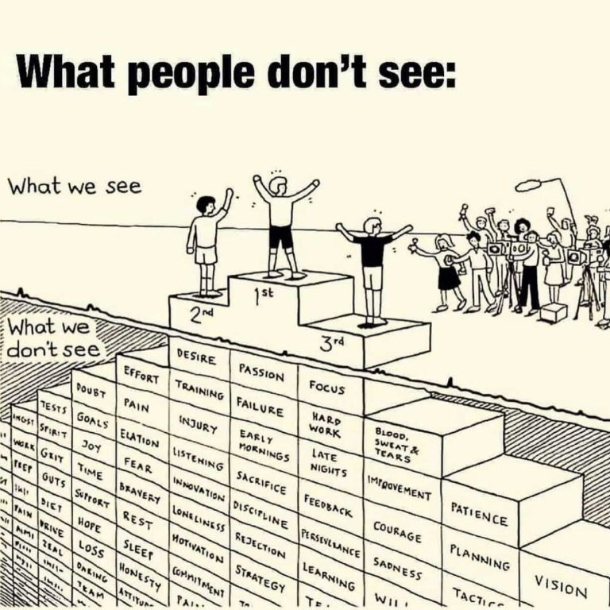

•	Analyzed over 5000+ customer records to optimize our marketing strategies through generating multiple data-driven insights (KPI and Metrics). 
•	Allocated 40% of Marketing budget to another Marketing campaign, which led to a 30% increase in overall client’s engagement.
•	Provided visualization dashboard on routine Marketing campaigns and Return on Investment.
•	Performed regression analysis to understand future sales and marketing engagement and identify key metrics to be emphasized when making Marketing decisions.

<Row>
<Col>

</Col>
<Col>

</Col>
</Row>

<Row>
<Col>

Text

</Col>
<Col>

Text

</Col>
</Row>